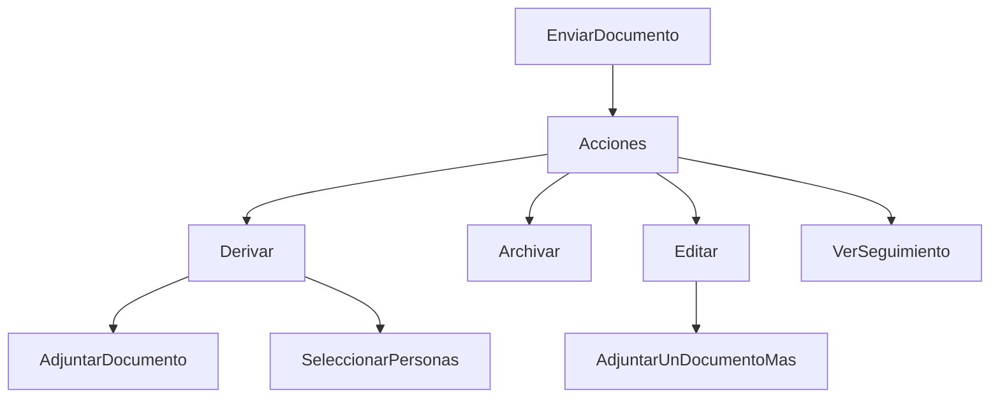
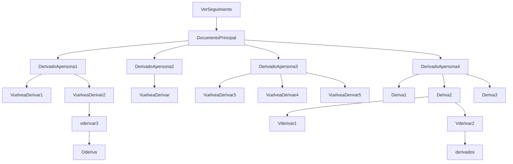

# Gestor de Documentos


El gestor de documentos tiene como fin el poder enviar recepcionar y tener el flujo
de los distintos documentos que se manejan en el hospital, esto con la intención
de tener todo respaldado de manera digital, esto esta apegado a  *[Ley de Transformación Digital](https://digital.gob.cl/transformacion-digital/ley-de-transformacion-digital/).*

*******************
## Desarrollo


Siguientes tecnologías y Plugin.

- *[Codeigniter 3](https://www.codeigniter.com/userguide3/index.html).*
- *[PHP 7](https://www.php.net/manual/es/).*
- *[Jquery 3.5.1](https://api.jquery.com/category/version/3.5/).*
- *[Ajax](https://developer.mozilla.org/es/docs/Web/Guide/AJAX).*
- *[Bootstrap 5.0](https://getbootstrap.com/docs/5.2/getting-started/introduction/).*
- *[DataTables](https://datatables.net/).*
- *[File Input Krajee](https://plugins.krajee.com/file-input#usage).*
- *[Selector WebComponents Componente Local realizado Por Cristian Valenzuela](http://10.5.225.61:8929/cristian.valenzuela/selector-webcomponent/-/tree/main/).*
- *[Navbar WebComponents Componente Local realizado Por Cristian Valenzuela](http://10.5.225.61:8929/cristian.valenzuela/navbar-webcomponent).*
- *[Font Awesome Icons](https://fontawesome.com/v6/search?m=free).*
- *[AutoSize.js by Jack Moore](https://www.jacklmoore.com/autosize/).*
- *[Sweet Alert](https://sweetalert.js.org/).*

*******************
# Codigo


## Vista (MVC)


```php
	<?php $this->load->view('asidebar'); ?>
	<?php $this->load->view('navbar'); ?>
	<?php $this->load->view('searchingNav'); ?>
```

De esta manera realizamos la llamada a las diferentes vistas, en este caso llamamos a asidebar, navbar,
searchingNav, los cuales están divididos en sus respectivos archivos en la vista, también tenemos la
llamada a los diferentes modal que usamos, esto lo realizamos para que el código sea más fácil de interpretar,
los modales se llaman a la vista principal, para poder tener interacción con ellos.

```php
	<?php $this->load->view('modalSend'); ?>
	<?php $this->load->view('modalCreateNewDoc'); ?>
	<?php $this->load->view('modalTracing'); ?>
	<?php $this->load->view('modalTracingClick'); ?>
	<?php $this->load->view('modalEdit'); ?>
```

Al final de la vista principal tenemos un script, com todo lo relacionado con javascript, para uso del
proyecto

```javascript
	autosize(document.querySelectorAll('textarea'));
```

Con este llamado estamos solicitando todos los campos de tipo *textarea*, para inicializar en estos
el plugin autosize el cual al momento de escribir este se va agrandando asi no se pierde el text escrito.

```javascript
	
var datatable = $('#data_table').DataTable({
	"pageLength": 10,
	"order": [
		[3]
	],
	"responsive": true,
	"scrollY": '68vh',
	"scrollCollapse": true,
	"lengthChange": false,
	"dom": 'Blftrip',
	"search": true,
	"buttons": ['excel'],
	"pagingType": 'full_numbers',
	"language": {
		"decimal": ".",
		"emptyTable": "No hay datos para mostrar",
		"info": "del _START_ al _END_ (_TOTAL_ total)",
		"infoEmpty": "del 0 al 0 (0 total)",
		"infoFiltered": "(filtrado de todas las _MAX_ entradas)",
		"infoPostFix": "",
		"thousands": "'",
		"lengthMenu": "Mostrar _MENU_ entradas",
		"loadingRecords": "Cargando...",
		"processing": "Procesando...",
		"search": "Buscar:",
		"zeroRecords": "No hay resultados",
		"paginate": {
			"first": '',
			"last": '',
			"next": '<i class="fa-solid fa-arrow-right-long"></i>',
			"previous": '<i class="fa-solid fa-arrow-left-long"></i>'
		},
		"aria": {
			"sortAscending": ": ordenar de manera Ascendente",
			"sortDescending": ": ordenar de manera Descendente ",
		}
	},
	'ajax': {
		"url": '<?= base_url(); ?>index.php/index/get_DataFormAll',
		"type": "POST",
		dataSrc: ''
	},
	'columns': [{
		data: 'tipoDoc',
		render: function (data) {
			if (data === 'IMPORTANTE') {
				return '<i class="fa-solid fa-circle-exclamation" style="color: red;"> ' + data;
			} else if (data === 'PRIVADO') {
				return '<i class="fa-solid fa-lock text-dark"></i> ' + data;
			} else if (data === 'ORDINARIO') {
				return '<i class="fa-regular fa-file-lines text-dark"></i> ' + data;
			}
		}
	},
		{
			data: 'asunto'
		},
		{
			data: 'comentario',
			render: function (data) {
				newComment = (data.length > 15) ? data.slice(0, 15 - 1) + '....' : data;
				return newComment;
			}
		},
		{
			data: 'folio'
		},
		{
			'orderable': true,
			className: 'text-center',
			render: function (data, type, row) {
				return '<button type="button" id="eyeTracing"  value="' + row.id + '" class="btn btn-dark me-1" data-bs-toggle="tooltip" data-bs-placement="top" title="Seguimiento"><i class="fa-solid fa-eye"></i></button>' +
					'<button type="button" id="docEdit" value="' + row.id + '" class="btn btn-primary me-1" data-bs-toggle="tooltip" data-bs-placement="top" title="Editar Documento"><i class="fa-solid fa-file-pen"></i></button>' +
					'<button type="button" id="reSend" value="' + row.id + '" class="btn btn-success" data-bs-toggle="tooltip" data-bs-placement="top" title="Re envio de Documentos"><i class="fa-solid fa-envelopes-bulk"></i></button>';
			}
		},
	],
});
```

esta es la llamada al datatable para poder desplegarlo en pantalla esto lo utilizamos mediante ajax,
se realiza la llamada a datatable, se inicializan los valores ***que están más arriba en la documentation***,
posterior a configurar el datatable se llama a ***$.ajax({});*** para realizar la solicitud a la url, la que
tiene como direction ***base del proyecto/controlador/función*** se procesan los datos pedidos, mediante el
parámetro ***column*** podemos ordenar nuestro datatable, para poder generar funciones ocupamos la función ***render:***
que nos permite retornar un valor procesado, en el caso de ***data: 'comentario'*** la function recorta el nombre
con el fin de tener una estructura en la la tabla a mostrar, en el caso de ***data: 'tipoDoc'*** es una condicional
que nos permite identificar que tipo de documento se envío, esto para poder adjuntar un icono según el tipo, parte importante
del data table es el ultimo item ***'orderable'***, ya que este crea de manera dinámica 3 botones, ***reSend, docEdit, eyeTracing***
los cuales manejamos de forma dinámica con ajax y jquery, estos botones quedan con un valor ***'value'*** que corresponde al formulario.


```javascript
	$('#btnImportant').click(() => {
	datatable.column()
		.search('IMPORTANTE')
		.draw();
```

Esta función está realizada con Jquery se llama a Jquery con el Símbolo ***'$'***, esta función se dispara al hacer
***'click'*** en el botón con el ***Identificador (ID) 'btnImportant'***, al lanzarse la función realiza un filtro al
datatable, para dejar solo los documentos que son de tipo ***IMPORTANTE***.

```javascript
	$('#data_table').on('click', '#reSend', function () {
	//console.log($(this).val());
	let valBtn = $(this).val();
	$('#derivationBtnSend').val(valBtn);
	$('#archivedBtn').val(valBtn);
	$('#derivateFile').addClass('d-none');
	//	console.log(valBtn);
	$.ajax({
		url: '<?= base_url();?>index.php/index/get_User',
		method: 'post',
		data: {idQuery: $(this).val()},
		dataType: 'json'
	}).done((data) => {
		//console.log(data);
		$('#docDestiny').empty();
		$.each(data, function (idx, opt) {
			$('#docDestiny').append(
				opt.userCreador + '<i class="fa-solid fa-file-export me-1 ms-1"></i>' + opt.userRecibe + '<br><br>');
		});
	});

	$.ajax({
		url: '<?= base_url(); ?>index.php/index/allDataJoin',
		method: 'post',
		data: {idQuery: $(this).val()},
		dataType: 'json',
	}).done(function (data, type, row) {
		$('#sendAsunto').empty();
		$('#sendFolio').empty();
		$('#sendComentario').empty();
		$('#sendFecha').empty();
		$('#docData').empty();

		$.each(data, function (idx, opt) {

			$('#sendAsunto').append('Asunto: ', opt.asunto);
			$('#sendFolio').append('Folio: ', opt.folio);
			$('#sendComentario').append(opt.comentario);
			$('#sendFecha').append(opt.fecha);
		});

		$.ajax({
			url: '<?= base_url(); ?>index.php/index/get_DataDocSend',
			method: 'post',
			data: {idQuery: valBtn},
			dataType: 'json',
		}).done((data) => {
			//console.log(data);
			$.each(data, function (idx, opt) {
				let newName = (opt.nombreDoc.length > 10) ? opt.nombreDoc.slice(0, 10 - 1) + '....' : opt.nombreDoc;
				if (data.length > 0) {
					if (opt.extensionDoc == 'pdf' || opt.extensionDoc == 'PDF') {
						//PDF
						opt.extensionDoc = '';
					} else if (opt.extensionDoc == 'doc' || opt.extensionDoc == 'docx' || opt.extensionDoc == 'DOC' || opt.extensionDoc == 'DOCX') {
						//WORD
						opt.extensionDoc = '';
					} else if (opt.extensionDoc == 'jpg' || opt.extensionDoc == 'jpeg' || opt.extensionDoc == 'JPG' || opt.extensionDoc == 'JPEG') {
						//JPG
						opt.extensionDoc = '';

					} else if (opt.extensionDoc == 'xls' || opt.extensionDoc == 'xlsx' || opt.extensionDoc == 'XLS' || opt.extensionDoc == 'XLSX') {
						//XLS
						opt.extensionDoc = '';

					} else if (opt.extensionDoc == 'txt' || opt.extensionDoc == 'TXT') {
						//TXT
						opt.extensionDoc = '';
					}
					$('#docData').append(
						'<div class="col-md-3">' +
						'<div class="card m-1 p-2" style="width: 7rem;">'
						+ opt.extensionDoc +
						'<div class="card-body">' +
						'<a href="<?= base_url('uploads/'); ?>' + opt.nombreDoc + '" target="_blank" class="card-text text-decoration-none" title="' + opt.nombreDoc + '" id="documentStatus">' + newName + '</a>' +
					'</div>' +
					'</div>' +
					'</div>'
				);
				}
				//append input
				$('#formValue').val(opt.formularioId);
			});
		});
	});
	$('#modalReSend').modal('toggle');
});
```

Esta función es para desplegar el modal de reenvío o Derivación, se desplega al hacer click en el botón que tiene 
el ***Identificador (ID) 'reSend'*** al hacer click desplega el modal, al hacer click se genera la variable ***'valBtn'***,
esta toma el valor que viene en el botón, este valor lo agregamos a ***'derivationBtnSend, archivedBtn'***, y agregamos
una clase con la función ***'addClass', al identificador 'derivativeFile'***, siguiente de eso lanzamos ajax, con una petición
al backend, donde ***'url' corresponde a la ruta, 'method', corresponde al tipo enviado 'POST'/'GET', 'data', son variables 
que enviamos desde ajax a nuestro backend, y el 'dataType' corresponde a un JSON,(Formato de Trabajo)***, con la función de ajax
 *done*, recibimos lo que nos envía desde el backend(respuesta), y lo procesamos, en este primer ajax limpiamos el identificador
***'docDestiny'*** con la función de ajax ***'.empty'***, con la función ***'$each'*** recorremos el ***'data'(respuesta del servidor)***,
y sobre el mismo identificador ocupamos la función ***'.append'*** para poder agregar un trozo de código con información, podemos
ver que se agrega ***```opt.userCreador + '<i class="fa-solid fa-file-export me-1 ms-1"></i>' + opt.userRecibe + '<br><br>'```*** 
el cual tiene como información que nos llega del backend *opt*(indice)*.userCreador* asi se llama el cambo en la tabla de
base de datos.


para el segundo ajax al terminar de realizar la petición limpia los campos con la función ***'.empty'`***, ```$('#sendAsunto').empty();``` luego de tener
los espacios sin valores recorremos los datos enviados desde el backend, con la función ***'$.each'***, ```$.each(data, function (idx, opt){}``` cada data lo 
insertamos en un campo con un identificador por medio de la función ***'.append'***, ```$('#sendAsunto').append('Asunto: ', opt.asunto);```.

Antes de cerrar la función ***'done'*** de ajax, realizamos una nueva llamad a ajax, para solicitar información al backend,
al recibir esta solicitud, la recorremos mediante la función ***'$.each'***, también realizamos validación mediante condicional
*if* verificamos si data(respuesta del backend), viene vacío ```if (data.length > 0)```, si tiene datos, preguntamos,
si la extension del documento es igual a *pdf, docx, doc, jpeg* si es asi, igualamos a la imagen respectiva(esta se mostrara más adelante),
se realiza un append, en conjunto con la extension, el nombre del documento y la ruta del servidor(carpeta donde se sube el documento).
```javascript
	$('#docData').append(
	'<div class="col-md-3">' +
	'<div class="card m-1 p-2" style="width: 7rem;">'
	+ opt.extensionDoc +
	'<div class="card-body">' +
	'<a href="<?= base_url('uploads/'); ?>' + opt.nombreDoc + '" target="_blank" class="card-text text-decoration-none" title="' + opt.nombreDoc + '" id="documentStatus">' + newName + '</a>' +
	'</div>' +
	'</div>' +
	'</div>');
```
Esto nos mostrará el enlace del documento y podremos visualizar una imagen el tipo de document, al hacer click en el enlace que nos deja
podremos ir directamente al documento(en caso de ser tipo Doc, Docx), este se *descarga de manera automática.*

Para finalizar esta parte dejamos el valor del formulario en un input ```$('#formValue').val(opt.formularioId);```
y desplegamos el modal con lo anterior ya cargado ```$('#modalReSend').modal('toggle');```

*******************

Al hacer click en el botón de derivación(dentro del modal de reenvío / derivación), este esconde al footer del modal,
y el lado izquierdo del modal, al escoger estas partes mediante un append le asignamos código para obtener un selector de
personas, un campo de comentario opcional, y un campo para adjuntar un documento ese proceso lo realizamos mediante Jquery,
con estos campos en pantalla podemos ver que queda solo el botón de derivar.

```javascript
$('#derivationBtn').on('click', () => {
			$('#footerHide').hide();
			$('#derivationBtnSend').removeClass('d-none');
			$('#derivateFile').removeClass('d-none');
			$('#sendComentario').empty();
			$('#docDestiny').empty();

			$('#docDestiny').append(
				'<selectorprestaciones-component class="w-100">' +
				'<div class="text-center mb-1">Derivado a: <i class="fa-solid fa-file-import"></i>' +
				'</div>' +
				'<selector-webcomponent name="selectorpersonas"' +
				'url="http://10.5.225.24/api/index.php/SelectorWebComponent/lists"' +
				'cat="personas" list="true"' +
				'token="<?= $token;?>"' +
				'confirmDelete="true" allowDuplicates="false"' +
				'label="Agregar Usuarios.." id="derivationUser">' +
				'</selector-webcomponent>' +
				'</selectorprestaciones-component>'
			);
			$('#sendComentario').append(
				'<div class="input-group">' +
				'<span class="input-group-text">Comentario</span>' +
				'<textarea class="form-control" aria-label="With textarea" id="derivatedComment"' +
				'name="derivatedComment"></textarea>' +
				'</div>'
			);

		});
```

Al enviar la derivación, tenemos dos casos, el primero, si se envía el documento sin destinatario esta mostrara una alerta,
ya que al derivar tiene que ir dirigido a al menos una persona, lanzamos una petición por ajax, por la cual enviaremos los datos
del formulario de derivación, el retornar los datos desde el backend, subimos el documento, recargamos el data table, mostramos un mensaje
mediante sweetalert, y cerramos el modal.

```javascript
$('#derivationBtnSend').on('click', (e) => {
			let idBtn = $('#derivationBtnSend').val();
			const derivateSelect = document.querySelector('#derivationUser');
			let derivateUser = derivateSelect.getList();
			let derivatedComment = $('#derivatedComment').val();
			//console.log(idBtn);
			if (derivateUser < 1) {
				swal({
					title: "Error!",
					text: "Seleccione a quien Derivar!",
					icon: "error",
					button: "Volver"
				});
			} else {
				$.ajax({
					url: '<?= base_url();?>index.php/index/add_DerivativeData',
					method: 'post',
					data: {
						derivateUser: derivateUser,
						derivatedComment: derivatedComment,
						idQuery: idBtn
					},
					dataType: 'json',
				}).done((data) => {
					//console.log(data);
					$('#modalReSend').modal('toggle');
					$('#addDerivateFile').fileinput('upload');
					$('#data_table').DataTable().draw();
					$('#data_table').DataTable().ajax.reload();
					swal({
						title: "Derivado Con Exito!!",
						icon: "success",
						button: "Ok"
					});
				});
			}
		});
```
### Función no Terminada

Al hacer click en el botón seguimiento(botón con icono de un ojo), se deplega un modal, con el seguimiento del Documento,
se limpia el campo donde trabajaremos mediante empty ```$('#tracingData').empty();``` se toma el valor del botón ```let eyeTracing = $(this).val();```
este se envía con la petición realizada por Ajax, obtenemos la respuesta de backend mediante la variable ***dataUser***
la recorremos con un *for*, revisando si la cantidad de datos es menor a 0, validamos con un *if* si creadorCod es = a quienDerivaCod
se realiza un append del documento Principal, luego validamos si el creador es diferente del user logeado, si es correcto,
realizamos un append de los datos e iconos, de lo contrario saltamos al bloque que sigue, el cual realiza un append, del documento
derivado, ***este append lo realiza al ul con él, id correspondiente***

```javascript
$('#data_table').on('click', '#eyeTracing', function () {
			$('#tracingData').empty();
			let eyeTracing = $(this).val();
			//console.log(eyeTracing);
			$('#modalTracing').modal('toggle');

			$.ajax({
				url: '<?php echo base_url();?>index.php/index/get_UserDataTracing',
				method: 'post',
				data: {idDoc: eyeTracing},
				dataType: 'json',
			}).done((dataUser) => {
				//console.log(dataUser);
				for (let i = 0; i < dataUser.length; i++) {
					if (dataUser[i].creadorCod == dataUser[i].quienDerivaCod) {
						$(
							"<li class='list-group-item bg-secondary'>"
							+ dataUser[i].userCreador + "<span class='badge badge-info'> " +
							" Documento " + dataUser[i].fecha + "</span> " +
							"</li><ul id='" + dataUser[i].formKey + "'></ul>").appendTo('#tracingData');

						if (dataUser[i].creadorCod != <?= $_SESSION['cabcodigo']?>) {

							$("<li class='list-group-item bg-secondary'>"
								+ dataUser[i].userCreador + "<span class='badge badge-info'> " +
								" Documento " + dataUser[i].fecha + "</span> " +
								"</li><ul id='" + dataUser[i].formKey + "'></ul>").appendTo('#tracingData');
						}

					} else {

						$(
							"<li class='list-group-item'>" +
							"<span class='text-dark'> " +
							" Creo el Documento Con Fecha " + dataUser[i].fecha + "</span> "
							+ dataUser[i].quienDeriva + " <span class='fa fa-arrow-circle-right'></span> " + dataUser[i].listaUsuarios +
							"</li><ul id='" + dataUser[i].formKey + "'></ul>").appendTo('#tracingData #' + dataUser[i].formKey + '');
					}
				}


			});
		});
```


*******************

Al hacer click en el botón Crear Documento, nos desplegará un modal, con un ***selector de personas, asunto, n°folio, tipo de Documento,
comentario, y un campo donde se puede agregar documentos, todos de tipo inputs*** si alguno de estos campos viene vacío, al enviar, nos
arroja un sweetalert, diciendo que faltan campos por llenar, de lo contrario enviamos una solicitud con Ajax, y enviamos las variables
que se refieren al input del formulario, al recibir los datos desde el backend, le agregamos al botón con ID ***'btnSendForm'***, y
validamos si, los datos enviados son mayor a 0 y si los archivos adjuntados son mayor a 0(esto quiere decir que se completó el formulario)
entonces limpiamos las variables, recargamos el data table con los nuevos documentos ingresados para finalizar mostramos un sweetalert con 
el envío de documento exitoso.

```javascript
$('#btnSendForm').on('click', (e) => {
			e.preventDefault();
			const select = document.querySelector('selector-webcomponent');
			let listUser = select.getList();
			let asunto = $('#asunto').val();
			let folio = $('#folio').val();
			let tipoDoc = $('#chooseType').val();
			let comentario = $('#comentario').val();
			let filesCount = $('#file').fileinput('getFilesCount');

			if (listUser == 0 || asunto == 0 || filesCount == 0 || folio == 0 || tipoDoc == 0 || comentario == 0) {
				swal({
					title: "Error!",
					text: "Faltan Campos Por Llenar!",
					icon: "error",
					button: "Volver"
				});
			} else {
				$.ajax({
					url: '<?= base_url();?>index.php/index/dataFormInsert',
					type: 'post',
					data: {
						asunto: asunto,
						folio: folio,
						tipoDoc: tipoDoc,
						comentario: comentario,
						listUser: listUser
					},
					dataType: 'json'
				}).done((data) => {
					//console.log(data);
					//add value to return from datFormInsert id
					$('#btnSendForm').val(data);
					//console.log(data);
					//clean field form
					if (data > 0 && filesCount > 0) {
						$('#file').fileinput('upload');
						$('#asunto').val('');
						$('#folio').val('');
						$('#chooseType').val('');
						$('#comentario').val('');
						$('#file').fileinput('clear');
						select.clearList();
						$('#modalCreateDoc').modal('hide');
						$('#data_table').DataTable().draw();
						$('#data_table').DataTable().ajax.reload();
					} else {
						console.log('Revise datos');
					}

				});
				swal({
					title: "Enviado Con Exito!",
					icon: "success",
					button: "Ok"
				});
			}
		});
```
### Tips Vista
*******************

Hay un plugins llamado file input está inicializado para cada subida de documentos, este tiene la siguiente estructura:
```javascript
$("#updateFile").fileinput({ //asi inicializamos el plugin tomando el id del input referente mediante Jquery
			language: 'es', //corresponde al lenguaje que se ocupa
			theme: "bs5", //el skin del plugins
			uploadUrl: '<?= base_url();?>index.php/index/update_EditDoc', //la ruta dirigida hacia el controlador que procesa los datos enviados
			uploadAsync: false, //para desabilitar la asincronia al subir el dcumento
			allowedFileExtensions: ['jpg', 'jpeg', 'img', 'gif', 'pdf', 'doc', 'docx'], //tipos de documentos soportados
			overwriteInitial: false, //para sobre escribir el segundo archivo subido por el primero, desabilitado
			initialPreviewAsData: true, //muestra una vista pequeña del documento que se subira
			maxFileSize: 300000, // tamaño maximo a subir
			removeFromPreviewOnError: true, // si hay algun error con los documentos estos no tendran vista previa y se quitaran automaticamente del plugin
			showClose: false, // mostrar el boton cerrar, false
			showPreview: true, // mostrar visualizasion
			showUpload: false, // mostrar boton subir, false
			uploadExtraData: function () { // envia al backend datos extras
				return {
					updateId: $('#updateDataEdit').val() //en este caso enviamos un id, al backend
				};
			}
		});
```
Para todos los inputs en este proyecto se está ocupando con la estructura antes mencionada.

```javascript
$.ajax({  //llamada a ajax
	url: '<?= base_url();?>index.php/index/get_EditDoc', //ruta donde se procesan los datos
	method: 'post', //metodo el cual se envian datos
	data: {idQuery: idBtn}, //datos enviados desde ajax
	dataType: 'json', //tipo de datos, en este caso trabajamos datos en formarto json
}).done((data) => {}); //una ves recibidos los datos procedemos a trabajarlos mediante Done
```
De esta manera llamamos a Ajax para poder traer datos desde el backend.

```javascript
swal({
	title: "Error!",
	text: "Seleccione a quien Derivar!",
	icon: "error",
	button: "Volver"
	});
```

La estructura anterior corresponde a la llamada de Sweet Alert, que nos sirve para lanzar un aviso, un success o error

## Controlador (MVC)

```php
public function __construct()
	{
		parent::__construct();
		$this->load->model('FormModel');
		$this->load->model('DataFileModel');
		$this->load->model('DataFormUser');
		$this->load->model('KeyDataForm');
		$this->load->model('DerivativeDataModal');
		$this->load->model('ArchivedDataModel');
	}
```
Con esta función inicializamos la los modelos que se ocupan posteriormente, esto se inicia de forma automática.
Eso es de ayuda para poder llamar los distintos modelos que ocuparemos en el controlador

```php
public function index()
	{
		$user = $_SESSION['cabcodigo'];
		self::validateUser($user);
	}
```
La función index es la principal, el index es la primera página que se ve en la aplicación, esta tiene la función de verificar
si el usuario esta logeado, esto por medio de la función ***'validateUser'*** la cual toma el valor del código ***'user'***
el cual corresponde al código de quien a iniciado session.

```php
public function validateUser($userSession)
	{
		if ($userSession) {
			if (empty($userSession)) {
				$this->load->view('logout');
			} else {
				$token = array(
					'token' => self::get_ApiToken($userSession),
					'docRecive' => count($this->DataFormUser->get_RecibeData($userSession)),
					'importantDoc' => count($this->FormModel->get_Important()),
					'sendDoc' => count($this->DataFormUser->get_SendData($userSession)),
					'revisedDocument' => count($this->FormModel->get_RevisedDoc()),
					'docArchived' => count($this->FormModel->count_ArchivedData())
				);
				$this->load->view('index', $token);
			}
		} else {
			$this->load->view('logout');
		}
	}
```
Esta es la función que se llama en el index para verificar si el usuario esta logeado, la cual realiza, la que realiza
la validación, si existe la variable *$userSession*, luego si la variable *$userSession* se encuentra vacía, no redirige
a la ventana de salida, para poder volver a logearnos, de lo contrario, se genera un array con distintos campos.


- *generamos el token de usuario* ```'token' => self::get_ApiToken($userSession)```
- *consultamos cantidad de doc Recibido* ```'docRecive' => count($this->DataFormUser->get_RecibeData($userSession))```
- *consultamos cantidad de doc Importantes* ```'importantDoc' => count($this->FormModel->get_Important())```
- *consultamos cantidad de doc Enviados* ```'sendDoc' => count($this->DataFormUser->get_SendData($userSession))```
- *consultamos cantidad de doc Revisados* ```'revisedDocument' => count($this->FormModel->get_RevisedDoc())```
- *consultamos cantidad de doc Archivados* ```'docArchived' => count($this->FormModel->count_ArchivedData())```


Estas consultas las realizamos llamando mediante *'$this'* el modelo que realiza la consulta de datos, estos los
enviamos mediante un array a la vista principal ```$this->load->view('index', $token);``` por último si no vienen elementos
en la variable *$userSession* redireccionamos hacia la salida

```php
	public function add_DerivativeData()
	{
		$idQuery = $this->input->post('idQuery');
		$idForm = $this->FormModel->get_IdForm($idQuery);
		$derivativeUser = $this->input->post('derivateUser');
		$derivativeComment = $this->input->post('derivatedComment');
		$completeName = $_SESSION['cabnombre'] . " " . $_SESSION['cabapellido'];
		$sessionCode = $_SESSION['cabcodigo'];
		//echo json_encode($idForm); funcion para revisar cada variable
		$this->derivativeDataProcessing($derivativeUser, $completeName, $sessionCode, $idForm, $derivativeComment);
	}
```

En esta función tenemos la derivación de datos, donde recibimos por medio de post, mediante ajax, la variable ```$idQuery = $this->input->post('idQuery');```
la cual usamos para obtener un, id mediante la consulta al modelo ```$idForm = $this->FormModel->get_IdForm($idQuery);```
las variables *'$derivativeUser, $derivativeComment'* las tomamos mediante post, enviados por ajax, las variables *'$completeName, $sessionCode'*,
son realizadas mediante la global ***$_SESSION['']***, la cual toma de referencia los datos de quien ingresa a la aplicación
logeado, al terminar las declaraciones de las variables, procedemos a enviarlas a la función que las procesara ```$this->derivativeDataProcessing($derivativeUser, $completeName, $sessionCode, $idForm, $derivativeComment);```


```php
public function add_DerivativeDoc (){
		$derivativeId = $this->input->post('derivateId');
		if(!empty($_FILES)){
			$result = $this->add_DocumentAndStatus($derivativeId);
			echo json_encode($result);
		}else{
			echo 'SinDoc';
		}

	}
```

Con esta función realizamos la derivación del documento, en donde recibimos mediante POST, y por ajax, la id, la cual
nos sirve para identificar que doc se deriva, validamos que el apartado de *$_FILES* no este vacío, luego enviamos
el cambio de estado mediante la llamada a la función  ```$result = $this->add_DocumentAndStatus($derivativeId);```
el resultado obtenido lo enviamos la front-end con formato Json, de lo contrario retornamos *'sin doc'*.

```php
protected function add_DocumentAndStatus($idUser)
	{
		$config['upload_path'] = './uploads/';
		$config['allowed_types'] = 'gif|jpg|jpeg|pdf|doc|docx';
		//$data = array('result' => 1);

		if(count($_FILES['file']['name']) == 0){
			$error = 'Sin doc para Subir';
			return $error;
		}else{
			$countItem = count($_FILES['file']['name']);
			for ($i = 0; $i < $countItem; $i++) {
				$this->load->library('upload', $config);
				$this->upload->initialize($config);

				$fileName = $_FILES['file']['name'][$i];
				$fileName = preg_replace('/([^.a-z0-9]+)/i', '_', $fileName);
				$_FILES['file2'] = array();
				$_FILES['file2']['name'] = $fileName;
				$_FILES['file2']['type'] = $_FILES['file']['type'][$i];
				$_FILES['file2']['tmp_name'] = $_FILES['file']['tmp_name'][$i];
				$_FILES['file2']['error'] = $_FILES['file']['error'][$i];
				$_FILES['file2']['size'] = $_FILES['file']['size'][$i];

				if (!$this->upload->do_upload('file2')) {
					$error = array(
						'error' => $this->upload->display_errors()
					);
					$data['result'] = 0;
					$data['message'] = $error;
				} else {
					$uploadData = $this->upload->data();
					$result = array(
						'file' => $uploadData['file_name'],
						'extension' => strtolower(pathinfo($uploadData['file_name'], PATHINFO_EXTENSION)),
						'id' => $idUser,
						'estado' => 2
					);
					$idDocInsert = $this->DataFileModel->add_DocStats($result);
					echo json_encode($idDocInsert);
				}
			}
		}
	}
```

Esta estructura nos sirve para poder subir documentos al servidor, con la variable ***'$config'*** agregamos dos
datos importantes, la ruta donde se almacenan los documentos y el tipo de documentos que se recibirán, lo siguiente es 
validar si la global *'$_FILES['']'* tiene archivos, si no tiene nada retorna un error, de lo contrario diremos que
la variable **'countItem'** es igual a la global, concatenando el archivo y el nombre de este, crearemos un ciclo *'for'*
donde decimos que si la variable **'$i'** (contador), es menor a la cantidad de archivos subidos, se aumentara en uno,
entonces cargamos la librería upload, con la configuración que asignamos al principio de la función ```$this->load->library('upload', $config);```
y la inicializamos ```$this->upload->initialize($config);``` asignamos a la variable ***'$fileName'*** el archivo, y el nombre
del archivo y el contador, despues limpiamos el nombre y incluimos un **_** por cada espacio ```$fileName = preg_replace('/([^.a-z0-9]+)/i', '_', $fileName);```
asignamos un array ***'file2'*** el cual igualamos a los diferentes datos del documento peso, nombre etc.

Lanzamos un *'if'* donde iniciamos la subida de documento, si el documento no tiene nada, desplegamos error, de lo contrario
asignamos la subida de documento a una variable con la librería *'upload'* ```$uploadData = $this->upload->data();```
y creamos una variable de tipo array donde asignamos las distintas partes del documento, insertamos estos datos
mediante la llamada al modelo y su función requerida, y le pasamos la variable con el array de datos, esta función
nos devuelve un valor que es él, id del documento insertado ```$idDocInsert = $this->DataFileModel->add_DocStats($result);```, el cual enviamos mediante ```echo json_encode($idDocInsert);```

```php
public function derivativeDataProcessing($user, $sendUser, $derivativeCod, $idForm, $comment)
	{
		if (empty($user)) {
			echo 'No hay Destinatarios Seleccionados';
		} else {
			for ($i = 0; $i < count($user); $i++) {
				foreach ($idForm as $key) {
					$newListId = $user[$i]['value'];
					$newListName = $user[$i]['label'];
					$derivativeData = array(
						'listaUsuarios' => $newListName,
						'codListaUser' => $newListId,
						'comentarioDerivarDoc' => $comment,
						'formKey' => $key['formKey'],
						'quienDeriva' => $sendUser,
						'quienDerivaCod' => $derivativeCod
					);
					$this->DerivativeDataModal->add_DerivativeData($derivativeData);
					echo json_encode($derivativeData);
				}
			}
		}
	}
```

Esta función inserta los datos de los usuarios derivados, cuando se lanza la función esta revisa si el *'$user'* viene con 
usuarios o viene vacía, si esta viene vacía nos devuelve un error, de lo contrario, realizamos el ciclo *'for'* y contamos
la cantidad de usuarios que vienen listados, a continuación lanzamos un *'foreach'* sobre *'$idForm'* con esto podemos tomar
un dato del objeto, listamos las variables que corresponden al, id de usuario el nombre del usuario, y los datos de 
derivación los cuales enviamos mediante un *array*, llamamos el modelo y lanzamos la función respectiva pasando por parámetro el array
creado con los datos anteriores ```$this->DerivativeDataModal->add_DerivativeData($derivativeData);```

```php
public function update_DocStatus()
	{
		$idForm = $this->input->post('idForm');
		self::update_DocumentStatus($idForm);
	}

	protected function update_DocumentStatus($id)
	{
		$this->DataFileModel->update_StatusDoc($id);
		//echo json_encode($idForm); para probar si era correcto el valor obtenido
	}
```

La primera función ```public function update_DocStatus()``` recibe desde ajax el id del formulario, y a su vez se realiza
la llamada a la función ```protected function update_DocumentStatus($id)``` donde nos pide un parámetro para realizar
la actualización de documentos, con esto podemos realizar la actualización mediante la función ```$this->DataFileModel->update_StatusDoc($id);```

```php
public function dataFormInsert()
	{
		$userList = $this->input->post('listUser');
		$dataForm = array(
			'affair' => $this->input->post('asunto'),
			'invoice' => $this->input->post('folio'),
			'docType' => strtoupper($this->input->post('tipoDoc')),
			'comment' => $this->input->post('comentario')
		);
		$idForm = $this->FormModel->add_DataForm($dataForm);
		self::insertDataUser($userList, $idForm);
		echo json_encode($idForm);
	}
```
Esta función recibe mediante ajax las variables enviadas, son datos del formulario, los cuales se toman mediante una variable
y un array de datos, insertamos los datos del formulario enviando el array, el cual nos devuelve la id del formulario,
lanzamos la función ```self::insertDataUser($userList, $idForm);``` la cual nos pide dos parámetros para insertar.

```php
public function insertDataUser($list, $key)
	{
		$completeName = $_SESSION['cabnombre'] . " " . $_SESSION['cabapellido'];
		$sessionCode = $_SESSION['cabcodigo'];
		if (empty($list)) {
			echo 'No hay Destinatarios Seleccionados';
		} else {
			for ($i = 0; $i < count($list); $i++) {
				$newListId = $list[$i]['value'];
				$newListName = $list[$i]['label'];
				$newlistData = array(
					'completeName' => $completeName,
					'loginCod' => $sessionCode,
					'userRecibe' => $newListName,
					'recibeCod' => $newListId,
					'formKey' => $key
				);
				if (isset($sessionCode)) {
					$this->DataFormUser->add_DataFormUser($newlistData);

				} else {
					echo 'no esta logeado';
					//$this->DataFormUser->add_DataFormUser($newlisData);
				}
			}
		}
	}
```

Esta función inserta los datos anteriormente enviados, primero toma el nombre del usuario actual y el código, y validamos
si la lista enviada esta vacía, nos arroja un error, de lo contrario, iniciamos un ciclo *'for'* el cual verificamos
si la cantidad de usuarios es menor a 0 aumentamos en 1 nuestro contador, creamos una variable lista id, lista nombre, lista de datos,
luego validamos, si existe una session abierta lanzamos la función ```$this->DataFormUser->add_DataFormUser($newlistData);``` de lo contrario
arrojamos error.

```php
public function get_FirstNodo()
	{
		$id = $_SESSION['cabcodigo'];
		$data = $this->FormModel->get_MainNode($id);
		echo json_encode($data);
	}
```

La función ```get_FirstNodo()``` toma el documento para realizar el seguimiento, este primer documento se toma según
el código de la persona que esta logeada.

```php
public function get_DataFormAll()
	{
		$data = $this->FormModel->get_AllData();
		echo json_encode($data);
	}
```

Con la función ```get_DataFormAll()``` retornamos desde la base de datos todos los documentos que se mostraran en
el datatable.

```php
public function uploadFiles()
	{
		$status = 1;
		$dataBtn = $this->input->post('idQuery');
		//var_dump($dataBtn[0]);
		$this->add_Document($dataBtn, $status);
	}
```

Con la función ```public function uploadFiles()``` insertamos el documento según la id que nos envía ajax, esto con el
fin que el documento quede ligado al id, en esta función agregamos el estado al documento insertado.

```php 
protected function add_Document($idUser, $status)
	{
		$config['upload_path'] = './uploads/';
		$config['allowed_types'] = 'gif|jpg|jpeg|pdf|doc|docx';
		//$data = array('result' => 1);

		if(count($_FILES['file']['name']) == 0){
			$error = 'Sin doc para Subir';
			return $error;
		}else{
			$countItem = count($_FILES['file']['name']);
			for ($i = 0; $i < $countItem; $i++) {
				$this->load->library('upload', $config);
				$this->upload->initialize($config);

				$fileName = $_FILES['file']['name'][$i];
				$fileName = preg_replace('/([^.a-z0-9]+)/i', '_', $fileName);
				$_FILES['file2'] = array();
				$_FILES['file2']['name'] = $fileName;
				$_FILES['file2']['type'] = $_FILES['file']['type'][$i];
				$_FILES['file2']['tmp_name'] = $_FILES['file']['tmp_name'][$i];
				$_FILES['file2']['error'] = $_FILES['file']['error'][$i];
				$_FILES['file2']['size'] = $_FILES['file']['size'][$i];

				if (!$this->upload->do_upload('file2')) {
					$error = array(
						'error' => $this->upload->display_errors()
					);
					$data['result'] = 0;
					$data['message'] = $error;
				} else {
					$uploadData = $this->upload->data();
					$result = array(
						'file' => $uploadData['file_name'],
						'extension' => strtolower(pathinfo($uploadData['file_name'], PATHINFO_EXTENSION)),
						'id' => $idUser,
						'estado' => $status
					);
					$idDocInsert = $this->DataFileModel->add_Document($result);
					echo json_encode($idDocInsert);
				}
			}
		}
	}
```

Esta función es lo mismo que la principal, la diferencia está en que al usar esta función para subir documentos tenemos
que enviar un estado en conjunto con los datos del documento.

```php
private static function get_ApiToken($userLogin)
	{
		$url = 'http://10.5.225.24/api/index.php/auth/generarTokenUsuario/' . $userLogin;
		//call function with private static
		$result = json_decode(self::get_ApiData($url));
		$onlyToken = $result->token;
		return $onlyToken;
	}
```

Esta función nos pide un parámetro, el cual tiene que ser el código del usuario logeado, para poder crear el token con
el que funcionan los componentes, anteriormente nombrados, el cual se encripta con este método ```$result = json_decode(self::get_ApiData($url));```

```php
private static function get_ApiData($url)
	{
		$curl = curl_init();
		curl_setopt($curl, CURLOPT_URL, $url);
		curl_setopt($curl, CURLOPT_RETURNTRANSFER, 1);
		curl_setopt($curl, CURLOPT_SSL_VERIFYPEER, FALSE);
		curl_setopt($curl, CURLOPT_SSL_VERIFYHOST, FALSE);
		$result = curl_exec($curl);
		curl_close($curl);
		return $result;
	}
```

El método de encriptación, por parámetro necesitamos la url de la api, junto con el login user, primero definimos
la url mediante ```curl_setopt($curl, CURLOPT_URL, $url);``` después lo transformaremos a un string mediante ```curl_setopt($curl, CURLOPT_RETURNTRANSFER, 1);```
evitamos que el método CURL verifique el certificado SSL con ```CURLOPT_SSL_VERIFYPEER``` y para finalizar iniciamos
```CURLOPT_SSL_VERIFYHOST``` para verificar que el host sea correcto, inicializamos y retornamos el resultado.

```php
public function editReSend()
	{
		$idFromForm = $this->input->post('idQuery');
		//echo $idFromForm;
		$allDataJoined = $this->FormModel->get_EditData($idFromForm);
		echo json_encode($allDataJoined);
		//var_dump($allDataJoined);
	}
```

Con esta función solicitamos a la base de datos los campos de datos según el id enviado mediante ajax.

```php
public function get_EditDoc()
	{
		$id = $this->input->post('idQuery');
		$editDoc = $this->DataFileModel->get_EditDoc($id);
		echo json_encode($editDoc);
	}
```
Esta función corresponde a la solicitud de los documentos asociados a la id, para poder editar.

```php
public function update_Edit()
	{
		$id = $this->input->post('idQuery');
		$data = array(
			'editComentario' => $this->input->post('editComentario'),
			'editAsunto' => $this->input->post('editAsunto'),
			'editFolio' => $this->input->post('editFolio'),
			'editType' => $this->input->post('editType')
		);
		$this->FormModel->update_DataEdit($data, $id);
		$result = $id;
		echo json_encode($result);
	}
```

Actualizamos los datos, editados y retornamos la id.

```php
public function update_EditDoc()
	{
		$id = $this->input->post('updateId');
		$status = 4;
		//add id key from form to insertUpdated Document
		$error = $this->add_Document($id, $status);
		echo json_encode($error);
	}
```

subimos el documento actualizado y le damos un estado, de no subir documento nos devuelve error.

```php
	public function allDataJoin()
	{
		$idFromForm = $this->input->post('idQuery');
		$allDataJoined = $this->FormModel->get_AllDataFromTables($idFromForm);
		echo json_encode($allDataJoined);
		//var_dump($allDataJoined); para probar el campo devuelto desde la base de datos
	}
```

Realizamos llamada a la base de datos de todos los datos, según el id que nos envía ajax desde el frontend.

```php
public function get_User()
	{
		$key = $this->input->post('idQuery');
		$onlyUser = $this->FormModel->get_userData($key);
		echo json_encode($onlyUser);
	}
```

Según el id enviado desde el frontend mediante ajax, realizamos la consulta, solo obtenemos el usuario.

```php
public function get_DataDocSend()
	{
		$idquery = $this->input->post('idQuery');
		$data = $this->DataFileModel->get_DocDataSend($idquery);
		echo json_encode($data);
	}
```

Solicitamos el documento enviado según el id enviado desde el frontend mediante Ajax.

```php
public function get_DataTracingClick()
	{//form data comentary etc
		$idTracing = $this->input->post('idDoc');
		$main = $this->DataFileModel->get_TracingData($idTracing);
		echo json_encode($main);
	}
```

Para el seguimiento recibimos desde el frontend mediante ajax, el id para solicitar datos de formulario para poder iniciar el seguimiento.

```php
public function get_DataDoc()
	{
		//get document data for review data on click tracing
		$id = $this->input->post('idDoc');
		$data = $this->DataFileModel->get_DocDataTracing($id);
		echo json_encode($data);
	}
```

Recibimos desde el frontend mediante ajax, el id para solicitar el documento, para realizar el seguimiento.

```php
public function get_UserDataTracing()
	{
		//get user and document where id = user id
		$id = $this->input->post('idDoc');
		$data = $this->FormModel->get_UserDate($id);
		$this->get_second($id);
		//echo json_encode($data); metodo para probar si recibe 
	}
```

Recibimos desde el frontend mediante ajax, el id para solicitar los datos ingresados al formulario, para realizar el seguimiento.

```php
public function get_Second($id)
	{
		$data = $this->DerivativeDataModal->get_SecondDerivative($id);
		echo json_encode($data);
	}
```

Realizamos la llamada de datos para el seguimiento, según el id, entregado por el frontend mediante ajax.

```php
public function get_saveArchivedDoc()
	{
		$id = $this->input->post('id');
		$data = $this->ArchivedDataModel->get_JoinData($id);
		echo json_encode($data);
	}
```

Recibimos desde el frontend mediante ajax, el id para solicitar los documentos archivados, mediante el estado de este.

## Modelo (MVC)

La clase ```ArchivedDataModel``` tiene las siguientes funciones:

- ```get_JoinData``` solicita datos a BDO y realizamos inner join según el id recibido.
- ```add_ArchivedStatus``` solicita documento archivado según id y según estado.

La clase ```KeyDataForm``` tiene las siguientes funciones:

- ```add_UserFormKey``` recibimos un array desde el controlador para poder insertar datos.

La clase ```DataFileModel``` tiene las siguientes funciones:

- ```update_StatusDoc``` Actualizamos el estado del documento según id recibida.
- ```add_Document``` insertamos documentos y retornamos la id.
- ```add_DocStats``` recibimos un array de datos, para poder insertar por primera vez el documento y retornamos el id.
- ```add_Condition``` agregar estado, a un documento.
- ```get_DocDataSend``` solicitamos el documento según el id recibida mediante el controlador.
- ```get_TracingData``` solicitamos formulario según id enviado desde el controlador.
- ```get_DocDataTracing``` solicitamos documento según id para realizar seguimiento.
- ```get_EditDoc``` solicitamos el documento según el id recibido desde el controlador.

La clase ```DataFormUser``` tiene las siguientes funciones:

- ```add_DataFormUser``` recibimos el array, y validamos, si está vacío, verificar, retornamos error,
de lo contrario realizamos el insert de datos.
- ```get_SendData``` solicitamos datos enviados del formulario según código de login.
- ```get_RecibeData``` id de formulario según usuario que crea el documento.

La clase ```DerivativeDataModal``` tiene las siguientes funciones:

- ```add_DerivativeData``` insert de la derivación de documentos, tomamos la ip del equipo, y validamos
si el comentario viene con datos, insertamos datos del array, de lo contrario agregamos al comentario *'sin registro'*
e insertamos los datos.
- ```get_SecondDerivative``` solicitamos datos de quien deriva los documentos y formulario, según el id enviado desde el controlador.

La clase ```FormModel``` tiene las siguientes funciones:

- ```get_OnlyId``` solicitamos la id del formulario según el dato recibido.
- ```get_RevisedDoc``` solicitamos los datos totales según estado.
- ```get_MainNode``` solicitamos los datos del formulario principal para seguimiento según id obtenida.
- ```get_AllData``` obtenemos todos los datos insertados del formulario.
- ```get_EditData``` obtenemos los datos para editar según variable enviada desde el controlador, mediante la función *get_AllDataFromTables*.
 ```get_AllDataFromTables``` solicitamos los datos user creador, y su formulario y doc, según id recibida.
- ```get_UserData``` solicitamos data del creador según id enviado desde el controlador.
- ```get_IdForm``` solicitamos el id del formulario según el dato recibido desde el controlador.
- ```get_Important``` solicitamos solo los datos, que tienen como tipo IMPORTANTE.
- ```get_AllDocuments``` solicitamos la cantidad total de documentos que hay.
- ```add_DataForm``` validamos si el formulario viene con datos, de lo contrario insertamos datos, y retornamos id.
- ```update_DataEdit``` validamos si tenemos datos, de lo contrario actualizamos el form según los datos enviados y según id.
- ```get_UserDate``` solicitamos el usuario que crea el formulario según el id obtenido.
- ```count_ArchivedData``` solicitamos la cantidad de datos archivados, según estado.

## Flujo del Gestor



## Flujo del Seguimiento




